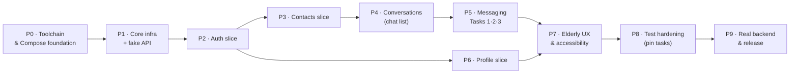

# Implementation Plan — Baseline Chat Application (Control Build)

> **Source design:** [TDD-Baseline-Chat-App.md](TDD-Baseline-Chat-App.md)
> **Module:** `:app` · package `com.gayathrini.chatapp`
> **Author:** Gayathrini · **Date:** 2026-06-05 · **Status:** Ready to execute

An ordered, executable build sequence for the baseline (control) chat app. Each phase is a
**self-contained, build-green increment** with explicit acceptance criteria and verification.
This document is a checklist — tick items as you go.

---

## 1. How to use this plan

- Build **in phase order**. Every phase must compile, run, and keep existing tests green before
  the next begins.
- Work in **vertical slices**: after the foundation, each feature phase delivers data + UI +
  tests together, so the app is demoable at every step.
- Develop **fake-API-first** (§8): a fake `ChatApi` lets all features be built and tested before
  the backend exists, then the real Retrofit implementation is swapped in at the end (Phase 9).
- Keep the build a **pure clean baseline** (TDD §2.2, §3.2): **no** middleware, trackers,
  assistance UI, "stuck" detection, or feature flags. Enforce this in review.

---

## 2. Guiding principles (from the TDD)

| Principle | Source |
|---|---|
| MVVM + Repository, unidirectional data flow | TDD §4 |
| Single-activity, Navigation-Compose | TDD §4.4 |
| Room = offline cache, network = source of truth on refresh | TDD §3.2, §6.2 |
| Elderly-appropriate UI is a baseline requirement, not polish | TDD §8.4, §10 |
| Business logic in unit-testable ViewModels/repositories | TDD §3.2, §11 |
| The three evaluation tasks must be pinned by E2E tests | TDD §11, §15 |

---

## 3. Current state → target

**Current skeleton** (verified): empty, **Views-based** Android project — only the
`com.android.application` plugin is applied; **no Kotlin/Compose plugin**; dependencies are
AppCompat/Material/JUnit/Espresso; **no `Application` class, no `MainActivity`** (manifest has no
`<activity>`); only `ExampleUnitTest`/`ExampleInstrumentedTest`. The version catalog
(`gradle/libs.versions.toml`) has **no Kotlin version** yet. `minSdk 24`, `targetSdk 36`,
`compileSdk 36`, AGP `9.2.1`, Java 11.

**Target:** the single-activity Jetpack Compose app described in the TDD §13 project structure.

**Files the foundation will touch:** `gradle/libs.versions.toml`, root `build.gradle.kts`,
`app/build.gradle.kts`, `app/src/main/AndroidManifest.xml`, `app/src/main/res/values/themes.xml`,
and new Kotlin sources under `app/src/main/java/com/gayathrini/chatapp/`.

---

## 4. Toolchain & dependency version matrix

> ⚠️ **Highest risk (TDD §12.3, §14): version alignment.** AGP `9.2.1` is very new; Kotlin, KSP,
> the Compose compiler plugin, Hilt, and the Compose BOM must be mutually compatible. **Phase 0
> exists to pin a coherent set and prove a clean build before any feature work.** The versions
> below are a **proposed starting set** — reconcile exact numbers against AGP 9.2.1 in Phase 0.

> **✅ Verified in Phase 0 (2026-06-05).** A clean `:app:assembleDebug` **and** `:app:testDebugUnitTest`
> pass with: Kotlin **2.2.0**, KSP **2.2.0-2.0.2**, Compose BOM **2025.06.01**, Hilt **2.59.2**,
> Navigation-Compose 2.9.0, Lifecycle 2.9.0, `core-ktx` **1.15.0**. AGP-9-specific changes that were
> required (easy to miss):
> - **Do NOT apply `org.jetbrains.kotlin.android`** — AGP 9 has *built-in Kotlin*; applying it throws
>   *"Cannot add extension with name 'kotlin'"*. Set the JVM target via
>   `kotlin { compilerOptions { jvmTarget.set(JvmTarget.JVM_11) } }`.
> - **Hilt must be ≥ 2.59.2** — 2.57/2.58 fail with *"Android BaseExtension not found"*; the old
>   `android.enableLegacyVariantApi` workaround was itself removed in AGP 9.
> - **`gradle.properties` flags:** `android.useAndroidX=true`, `android.nonTransitiveRClass=true`,
>   `android.disallowKotlinSourceSets=false` (KSP registers generated sources via the Kotlin
>   sourceSets DSL, which built-in Kotlin otherwise rejects).
> - **`core-ktx` pinned to 1.15.0** — the skeleton's 1.19.0 requires `compileSdk 37`; the TDD targets
>   36 (and only `android-36` is installed locally).

| Area | Library / plugin | Proposed | Notes |
|---|---|---|---|
| Language | `org.jetbrains.kotlin.android` | latest 2.x compatible w/ AGP 9.2.1 | add to catalog (absent today) |
| Compose compiler | `org.jetbrains.kotlin.plugin.compose` | = Kotlin version | Kotlin 2.0+ applies the compiler as a plugin (no separate compiler version) |
| Serialization | `org.jetbrains.kotlin.plugin.serialization` | = Kotlin version | for kotlinx-serialization |
| Codegen | `com.google.devtools.ksp` | matching Kotlin | Room + Hilt use KSP |
| UI | Compose BOM + `material3`, `ui`, `ui-tooling`, `activity-compose`, `navigation-compose`, `lifecycle-viewmodel-compose`, `lifecycle-runtime-compose` | current BOM | TDD §12.1 |
| DI | `com.google.dagger.hilt.android` + `hilt-compiler`, `androidx-hilt-navigation-compose` | current | |
| Network | `retrofit`, `okhttp` (+ logging), `kotlinx-serialization-json`, Retrofit kotlinx converter | current | TDD §6.4, §7 |
| Persistence | `room-runtime`, `room-ktx`, `room-compiler` (KSP); `datastore-preferences` | current | TDD §6.2, §6.3 |
| Images | `coil-compose` | current | avatars, message images |
| Concurrency | `kotlinx-coroutines-android` | current | |
| Test | `junit4`, `mockk`, `kotlinx-coroutines-test`, `turbine`, `androidx-compose-ui-test-junit4`, `androidx-test-espresso`/`ext-junit`, `okhttp-mockwebserver` | current | TDD §11 |

**Conventions:** central version catalog only; `buildFeatures { compose = true; buildConfig = true }`;
`API_BASE_URL` as a per-build-type `buildConfigField` (TDD §7.1, §9, §12).

---

## 5. Phase overview

| # | Phase | Size | Outcome |
|---|---|---|---|
| 0 | Toolchain & Compose foundation | M | App builds & launches a themed Compose screen; versions pinned |
| 1 | Core infrastructure + fake API | L | DI, network, nav, design system, Room/DataStore shells, fake `ChatApi` |
| 2 | Auth slice | M | Register/login, session persistence, cold-start routing, 401 refresh |
| 3 | Contacts slice | M | Contacts list/add/search; reusable contact picker |
| 4 | Conversations slice | M | Chat list with unread, new-chat, lifecycle polling, delete entry |
| 5 | Messaging slice | L | **Task 1 send text · Task 2 send photo · Task 3 delete**; optimistic send + receive polling |
| 6 | Profile slice | S | View/edit profile + avatar; logout |
| 7 | Elderly UX & accessibility | M | TDD §8.4/§8.5/§10 met across all screens |
| 8 | Test hardening | M | Unit + Compose E2E; the 3 tasks pinned before any clone |
| 9 | Real backend & release | M | Swap fake→real API; release build config |

---

## 6. Phase detail

### Phase 0 — Toolchain & Compose foundation  *(M)*
- **Goal:** turn the empty Views skeleton into a building, launchable **single-activity Compose**
  app with the Material 3 theme, and **pin a coherent version set**.
- **Build/deps:** add Kotlin + Compose + serialization + Hilt + KSP plugins to
  `gradle/libs.versions.toml` and the root `build.gradle.kts` (apply false); in
  `app/build.gradle.kts` apply them, enable `compose`/`buildConfig`, set Kotlin `jvmTarget = 11`,
  add Compose BOM + `activity-compose` + `material3` + lifecycle, add `API_BASE_URL` buildConfig
  fields per build type.
- **Create/modify:**
  - `ChatApplication.kt` (`@HiltAndroidApp`); register via `android:name` in the manifest.
  - `MainActivity.kt` (`@AndroidEntryPoint`, `setContent { ChatAppTheme { … } }`); add the
    `<activity>` + LAUNCHER intent-filter to `AndroidManifest.xml`.
  - `core/designsystem/Theme.kt`, `Color.kt`, `Type.kt` — Material 3 theme with large-default
    typography + AA-contrast colours (TDD §8.6).
  - `res/values/themes.xml` → a Compose-compatible Material 3 `NoActionBar` app/window theme.
- **Acceptance:**
  - [ ] `:app:assembleDebug` succeeds with the pinned versions.
  - [ ] App launches and shows a themed Compose placeholder.
  - [ ] Hilt application/activity compile (graph valid, even if empty).
- **Verify:** `./gradlew :app:assembleDebug` · `./gradlew :app:installDebug` (launch on
  device/emulator).

### Phase 1 — Core infrastructure + fake API  *(L)*
- **Goal:** the cross-cutting backbone every feature reuses, plus a fake API to unblock dev.
- **Depends on:** P0.
- **Create:**
  - `core/common/` — `Result`/`AppError` sealed types (Network/Unauthorized/Validation/Conflict/
    Server/Unknown, TDD §9), `DispatcherProvider`, common extensions.
  - `core/network/` — OkHttp (logging interceptor), `AuthInterceptor` (Bearer from `SessionStore`),
    `TokenAuthenticator` (single 401→refresh→retry, else clear session; TDD §7.2), Retrofit +
    kotlinx-serialization converter, the `ChatApi` Retrofit **interface** mirroring TDD §7.
  - `core/di/` — Hilt modules: `NetworkModule`, `DatabaseModule`, `DataStoreModule`,
    `DispatcherModule`, `RepositoryModule` (`@Binds`).
  - `core/navigation/` — typed routes (sealed), `ChatNavHost`, one-off nav-effect plumbing.
  - `core/designsystem/components/` — `PrimaryButton`, `LabeledTextField`, `MessageBubble`,
    `EmptyState`, `ErrorBanner`, loading scaffolds (TDD §8.6).
  - `data/local/` — `ChatDatabase` (Room) shell + type converters; `SessionStore` (Preferences
    DataStore: access/refresh token, userId, displayName; TDD §6.3).
  - `data/remote/FakeChatApi` — in-memory implementation of the API surface the repositories
    depend on (seeded users/contacts/conversations/messages), selectable via DI/build type (§8).
- **Acceptance:**
  - [ ] Hilt graph compiles end-to-end; `ChatNavHost` renders a placeholder start destination.
  - [ ] Fake API returns seeded data through a trivial probe.
  - [ ] Unit-test harness runs (MockK + coroutines-test + Turbine).
- **Verify:** `./gradlew :app:assembleDebug test`.

### Phase 2 — Auth slice  *(M)*
- **Goal:** end-to-end register/login on the fake API; session persists; cold-start routing.
- **Depends on:** P1.
- **Create:** `data/auth/` (`AuthRepository`(+Impl), DTOs, mappers → `/auth/*`, `/me`),
  `ui/auth/` (`LoginScreen`+`LoginViewModel`, `RegisterScreen`+`RegisterViewModel`),
  `LaunchRouter` (cold-start session check → Conversations | Login). Activate `AuthInterceptor` +
  `TokenAuthenticator`.
- **Acceptance:**
  - [ ] Register and login succeed; tokens stored in DataStore.
  - [ ] Cold start routes by session presence; logout clears session → Login.
  - [ ] Plain-language field/login errors (TDD §5.1).
- **Verify:** `./gradlew test` (Login/Register VM + AuthRepository tests) · manual run.

### Phase 3 — Contacts slice  *(M)*
- **Goal:** contacts list/add/search, cached in Room; reusable as the **contact picker**.
- **Depends on:** P2.
- **Create:** `data/contacts/` (repo, DTO, `ContactEntity`, DAO, mappers → `/contacts*`),
  register entity/DAO in `ChatDatabase`, `ui/contacts/` (`ContactsScreen`+`ContactsViewModel`),
  wire routes (standalone + picker mode).
- **Acceptance:**
  - [ ] List renders from cache then refreshes from API; add + search work.
  - [ ] Picker mode returns a selection that starts/opens a conversation.
- **Verify:** `./gradlew test` (ContactsViewModel, repo, mappers) · manual run.

### Phase 4 — Conversations (chat list) slice  *(M)*
- **Goal:** chat list with unread badges, new-chat via picker, lifecycle-aware **sync polling**,
  delete entry point (Task 3 surface).
- **Depends on:** P3.
- **Create:** `data/conversations/` (repo, DTO, `ConversationEntity`, DAO, mappers →
  `/conversations`, `/sync`), `ui/conversations/` (`ConversationsScreen`+`ConversationsViewModel`),
  FAB → contact picker → conversation, confirm-dialog delete (TDD §5.3, §5.6, §7.7).
- **Acceptance:**
  - [ ] List from cache + `/sync`; unread badges; last-message preview/time.
  - [ ] New chat from picker; delete with confirmation (optimistic removal).
  - [ ] Polling runs only while the screen is foreground (lifecycle-aware).
- **Verify:** `./gradlew test` (VM incl. polling start/stop) · manual run.

### Phase 5 — Messaging slice  *(L)* — **delivers the three evaluation tasks**
- **Goal:** the conversation screen with send/receive, photo upload, and delete — i.e. Tasks 1–3
  end-to-end on the fake API.
- **Depends on:** P4.
- **Create:** `data/messages/` (repo, DTO, `MessageEntity`, DAO, mappers, polling →
  `/conversations/{id}/messages`), `data/media/` (`POST /media` upload), `ui/conversation/`
  (`ConversationScreen`+`ConversationViewModel`). Implement: optimistic send with `clientId`
  (`SENDING`→`SENT`/`FAILED`+retry; TDD §5.4, §7.8), receive polling (~3 s, TDD §7.9),
  attach-photo → upload → `IMAGE` message, delete conversation from here too.
- **Acceptance:**
  - [ ] **Task 1:** pick contact → send a text message (optimistic, status ticks).
  - [ ] **Task 2:** attach a photo → upload → send `IMAGE` message.
  - [ ] **Task 3:** delete a conversation (confirm) from list and/or conversation.
  - [ ] Incoming messages appear via polling; failed sends show retry.
- **Verify:** `./gradlew test` (ConversationViewModel optimistic/retry/polling; MessageRepository;
  mappers) · manual run of all three tasks.

### Phase 6 — Profile slice  *(S)*
- **Goal:** view/edit display name + avatar; logout.
- **Depends on:** P2 (session). *(Parallelizable with P3–P5.)*
- **Create:** `data/profile/` (`ProfileRepository` → `/me`, `/media`), `ui/profile/`
  (`ProfileScreen`+`ProfileViewModel`).
- **Acceptance:** [ ] edit display name/avatar persists; [ ] logout clears session → Login.
- **Verify:** `./gradlew test` (ProfileViewModel, repo) · manual run.

### Phase 7 — Elderly UX & accessibility pass  *(M)*
- **Goal:** meet TDD §8.4/§8.5/§10 across **all** screens (this is a baseline requirement, not
  polish — usability must not be a confound).
- **Depends on:** P5, P6.
- **Tasks:** enforce **≥48×48 dp** targets + generous spacing; verify layouts at the **largest
  system font scale** without clipping (`BoxWithConstraints`/adaptive); **WCAG AA** contrast
  audit; TalkBack `contentDescription`s + logical focus order; plain, reassuring copy; confirm
  destructive actions; ensure every list/detail screen has explicit Loading/Empty/Error states;
  predictable back behaviour.
- **Acceptance:**
  - [ ] Accessibility checklist passes (targets, contrast, TalkBack, dynamic type).
  - [ ] No clipping/overlap at max font scale on a small screen.
- **Verify:** manual TalkBack + large-font run; Compose UI assertions for target sizes/labels.

### Phase 8 — Test hardening (pin the baseline)  *(M)*
- **Goal:** lock baseline behaviour with tests **before** the experimental clone is made (TDD §11,
  §15) so the only later difference is the middleware.
- **Depends on:** P7.
- **Tasks:** complete unit coverage (ViewModels/repositories/mappers via fakes + Turbine);
  **Compose UI E2E tests for Task 1, Task 2, Task 3**; optional MockWebServer integration tests
  for the API contract; remove `ExampleUnitTest`/`ExampleInstrumentedTest` placeholders.
- **Acceptance:**
  - [ ] `./gradlew test` green; instrumented suite green on an emulator.
  - [ ] Each of the three evaluation tasks has a passing end-to-end UI test.
- **Verify:** `./gradlew test` and `./gradlew connectedDebugAndroidTest`.

### Phase 9 — Real backend integration & release  *(M)*
- **Goal:** swap fake → real API once the ChatApp server is available; finalize build types.
- **Depends on:** P8 **and** backend availability (the server TDD).
- **Tasks:** point `API_BASE_URL` at the dev backend; switch DI to the Retrofit `ChatApi`; verify
  every TDD §7 endpoint against the live server; configure `release` (logging off, shrink per TDD
  §12.2); HTTPS-only (no cleartext); note token-at-rest hardening (TDD §9/§10).
- **Acceptance:**
  - [x] App works against the real backend for all features + the three tasks. *(wiring complete &
        builds green; live `https://chatapp-server-pied.vercel.app/api/v1` reachable — final
        on-device run is the user's step.)*
  - [x] `release` build installs and runs. *(`:app:assembleRelease` green → unsigned release APK;
        add a `signingConfig` to install on a device.)*
- **Verify:** manual end-to-end against the live API; `./gradlew :app:assembleRelease`.
- **✅ Done (2026-06-07):** `API_BASE_URL` → live server for debug+release; active `ChatApi` swapped
  from `FakeChatApi` to the real `@Named("remote")` Retrofit impl via a `USE_FAKE_API` BuildConfig
  flag (default `false`, `Lazy`-gated); `usesCleartextTraffic="false"` (HTTPS-only); release logging
  already off. `:app:assembleDebug`, `:app:testDebugUnitTest`, `:app:assembleRelease` all green.
  R8/shrink left disabled (needs kotlinx-serialization keep rules + on-device verification).

---

## 7. Testing & Definition of Done

- **Unit (JVM):** ViewModels (state transitions, error mapping), repositories (remote+local
  coordination, mapping), mappers — JUnit4 + MockK + `kotlinx-coroutines-test` + Turbine, against
  in-memory fakes (TDD §11).
- **UI (instrumented):** Compose tests for login, **send text (T1)**, **send photo (T2)**,
  **delete conversation (T3)**, plus accessibility checks.
- **Definition of Done (baseline):** all phases' acceptance boxes ticked; `./gradlew test` and the
  instrumented suite green; the three evaluation tasks each pinned by a UI test; **no middleware/
  trackers/flags present** (TDD §2.2); elderly-UX checklist (Phase 7) passed.

---

## 8. Backend dependency strategy (fake-first)

The backend is a separate artifact and may not be ready when client work starts (TDD §14 risk 1).
Mitigation: depend on a small **API surface interface**; provide a **`FakeChatApi`** (in-memory,
seeded) for Phases 1–8 and the Retrofit implementation for Phase 9. Optionally add MockWebServer
integration tests to validate JSON/contract shapes against TDD §7 before the live swap. This keeps
the entire app buildable, demoable, and testable without the server.

---

## 9. Risks & mitigations

| # | Risk | Mitigation | Source |
|---|---|---|---|
| 1 | **AGP 9.2.1 ⇄ Kotlin/KSP/Compose/Hilt** alignment | Phase 0 green-build gate before features | TDD §12.3, §14 |
| 2 | Backend not ready | Fake-API-first; swap in Phase 9 | TDD §14 |
| 3 | Polling latency/battery | Lifecycle-aware, foreground-only polling | TDD §7.7, §14 |
| 4 | Large-font layout breakage | Adaptive layouts + Phase 7 max-font tests | TDD §8.5, §14 |
| 5 | Scope creep into middleware | Enforce "no trackers/flags" in review | TDD §2.2, §14 |
| 6 | Token-at-rest security | Documented hardening; acceptable for lab study | TDD §9, §10 |

---

## 10. Appendix — phase → TDD traceability

| Phase | Primary TDD sections |
|---|---|
| P0 Toolchain | §3.3, §4.3–4.4, §8.6, §12 |
| P1 Core infra | §4, §6.2–6.4, §7, §9 |
| P2 Auth | §5.1, §6.3, §7.2/§7.4 |
| P3 Contacts | §5.2, §7.5 |
| P4 Conversations | §5.3, §5.6, §7.6/§7.7 |
| P5 Messaging | §5.4, §7.6/§7.8/§7.9, §15 (Tasks 1–3) |
| P6 Profile | §5.5, §7.4 |
| P7 Elderly UX | §8.4, §8.5, §10 |
| P8 Test hardening | §11, §15 |
| P9 Real backend | §7, §12.2, §9/§10 |

> **Note:** `./gradlew` examples assume a Unix shell; on this Windows environment use
> `.\gradlew.bat` (or `.\gradlew`). Instrumented tests require a connected device/emulator.
