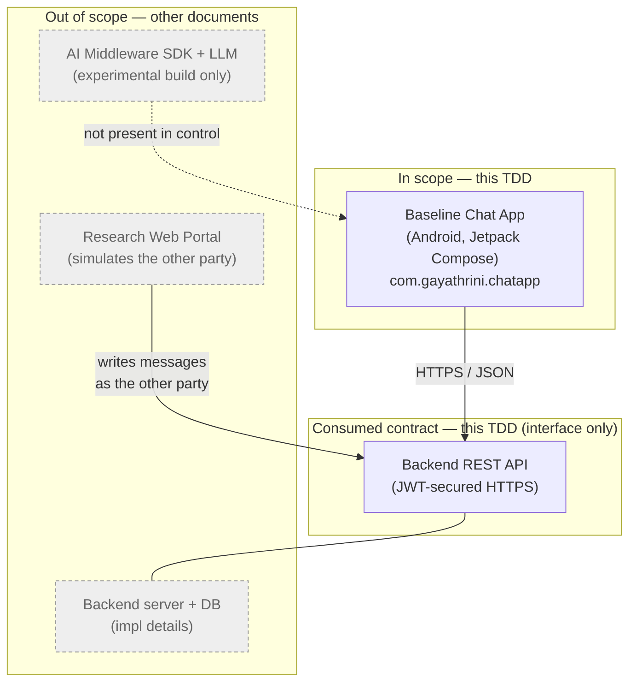
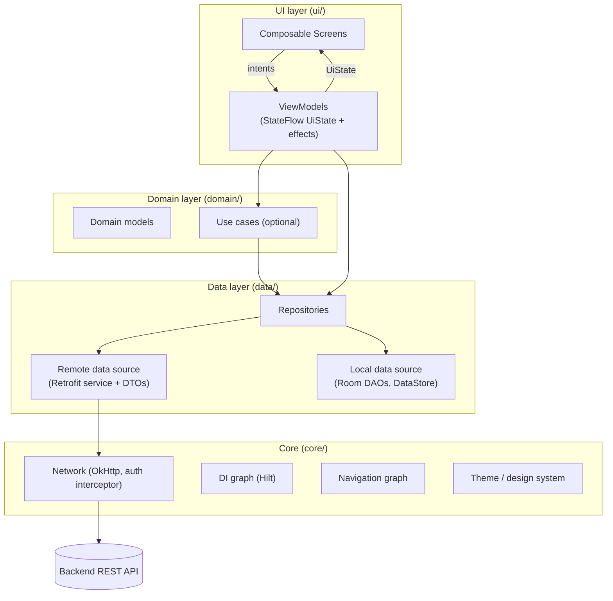
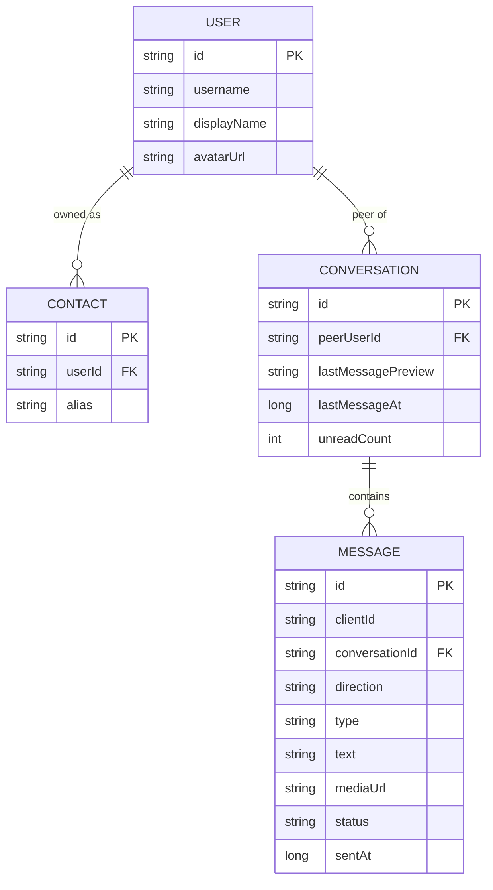
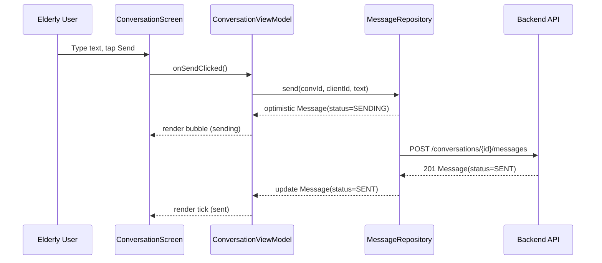
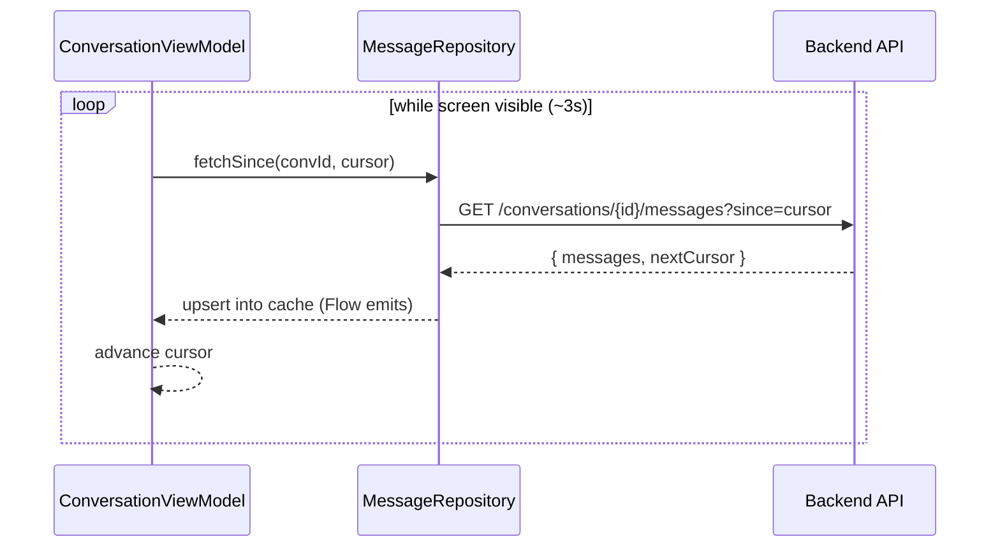
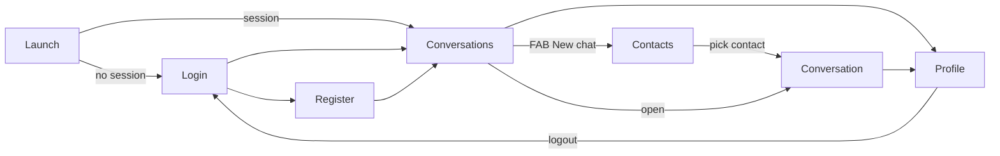

# Technical Design Document — Baseline Chat Application (Control Build)

> **Project:** AI-Powered, Context-Aware Assistance Middleware for Elderly Users
> **Artifact:** Baseline mobile chat application — *no middleware integration* (experimental control)

---

## 1. Document Control

| Field | Value |
|---|---|
| Document title | Technical Design Document — Baseline Chat Application (Control Build) |
| Version | 0.1 (Draft) |
| Status | For review |
| Author | Gayathrini |
| Date | 2026-06-05 |
| Applies to module | `:app` (`com.gayathrini.chatapp`) |
| Related documents | *(future)* Backend API TDD; AI Middleware SDK TDD; Research Web Portal TDD; Evaluation Plan |

### 1.1 Change log

| Version | Date | Author | Summary |
|---|---|---|---|
| 0.1 | 2026-06-05 | Gayathrini | Initial draft of the baseline (control) application design. |

---

## 2. Introduction

### 2.1 Purpose

This document specifies the technical design of the **baseline chat application** — the
*control* condition of a controlled experiment evaluating an AI-powered, context-aware
assistance middleware for elderly users. It is detailed enough to build the Android client
directly, and deliberately scoped so that a later, **identical** experimental build can layer
the middleware on top **without changing any baseline behaviour, UI, or feature**.

### 2.2 Research context

The research compares the *same* chat application under two conditions:

- **Control (this document):** the app with **no** assistance middleware.
- **Experimental (separate, later TDD):** a clone of this app with the middleware enabled.

For the experiment's *internal validity*, the only intended difference between the two builds
must be the presence of the middleware. Therefore the baseline must already be
**elderly-appropriate** (large targets, high contrast, simple flows); the middleware adds
*adaptive guidance*, not basic usability. This document does **not** contain any middleware
code, hooks, trackers, or feature flags — those belong to the experimental build.

### 2.3 Scope

**In scope**

- The Android chat client: architecture, components, screens, navigation, data model, local
  persistence, state management, error handling, testing strategy, and build/tooling changes.
- The **REST API contract the client consumes** (endpoints, payloads, status codes, auth),
  defined from the client's perspective.

**Out of scope** (covered by other documents)

- Backend server implementation and database schema (a separate Backend API TDD owns these;
  this document specifies only the contract the client depends on).
- The AI middleware SDK and its integration.
- The research web portal (researcher administration / chat simulation).
- Participant evaluation instruments (SUS, NASA-TLX, task scripts).

### 2.4 Definitions, acronyms, abbreviations

| Term | Meaning |
|---|---|
| TDD | Technical Design Document |
| MVVM | Model–View–ViewModel architectural pattern |
| UDF | Unidirectional Data Flow |
| DTO | Data Transfer Object (network/JSON model) |
| DI | Dependency Injection |
| JWT | JSON Web Token |
| FCM | Firebase Cloud Messaging |
| BOM | Bill of Materials (coordinated dependency versions) |
| DAO | Data Access Object (Room) |
| Control / Baseline | The app build *without* middleware (this document) |
| Experimental | The app build *with* middleware (separate TDD) |

### 2.5 References

- Current project skeleton: `app/build.gradle.kts`, `gradle/libs.versions.toml`,
  `app/src/main/AndroidManifest.xml`, `settings.gradle.kts`.
- Android architecture guidance (MVVM, repository pattern, UDF), Jetpack Compose, Room,
  Retrofit, Hilt, DataStore — current Jetpack libraries.

---

## 3. System Overview

### 3.1 Context

The baseline app is a thin, well-structured client of a backend REST API. It authenticates a
user, lists their contacts and conversations, and sends/receives text and image messages.
During the study, the **other party** in a conversation is driven by the research web portal,
which writes to the same backend — from the participant app's point of view this is an
ordinary conversation.



### 3.2 Design goals and principles

1. **Faithful control.** No middleware awareness of any kind. The codebase contains no
   trackers, no assistance UI, no "stuck" detection, and no feature flags for middleware.
2. **Elderly-appropriate by default.** Large touch targets, scalable typography, high
   contrast, plain language, and one primary action per screen — so usability is a *constant*,
   not a confound.
3. **Clean, conventional architecture.** MVVM + Repository with unidirectional data flow, so
   the experimental clone can later attach a middleware at obvious, stable seams (navigation,
   ViewModel events) *without* this document predefining them.
4. **Offline-tolerant.** Local cache (Room) renders last-known data instantly; network is the
   source of truth on refresh.
5. **Testable.** Business logic lives in ViewModels/repositories that are unit-testable in
   isolation; UI is verifiable with Compose UI tests.

### 3.3 Key constraints

- Target Android: `minSdk 24`, `targetSdk 36`, `compileSdk 36`; AGP `9.2.1`; Java 11.
- Single Gradle module `:app`; package `com.gayathrini.chatapp`.
- Backend availability: the client depends on the REST contract in §7 being implemented.

---

## 4. Architecture

### 4.1 Pattern

**MVVM + Repository with Unidirectional Data Flow.**

- **View (Compose):** stateless composables that render an immutable `UiState` and emit user
  intents as callbacks.
- **ViewModel:** holds `UiState` in a `StateFlow`, handles intents, calls repositories,
  exposes one-off effects (navigation, snackbars) via a `Channel`/`SharedFlow`.
- **Repository:** single source of truth per domain area; coordinates remote (Retrofit) and
  local (Room) data sources and maps DTOs ↔ domain models.
- **Data sources:** `RemoteDataSource` (REST) and `LocalDataSource` (Room/DataStore).



### 4.2 Layered responsibilities

| Layer | Responsibility | Must NOT |
|---|---|---|
| UI (Compose) | Render state, emit intents, collect effects | Contain business rules or call data sources directly |
| ViewModel | Own UI state, orchestrate use cases/repos, map errors to UI | Reference Android `Context`/views, touch the network directly |
| Domain | Pure models and optional use cases (business rules) | Depend on Android or framework types |
| Data | Fetch/cache/persist, map DTO ↔ domain | Leak DTOs or Room entities above the repository boundary |
| Core | Cross-cutting infra (network, DI, nav, theme) | Hold feature logic |

### 4.3 Dependency injection

**Hilt.** `@HiltAndroidApp` Application, `@AndroidEntryPoint` activity, `@HiltViewModel`
ViewModels. Modules provide: OkHttp/Retrofit, the API service, Room database + DAOs, DataStore,
and repository bindings (`@Binds` interface → implementation).

### 4.4 Navigation

**Navigation-Compose**, single `NavHost` in a single `MainActivity`. Type-safe routes are
declared centrally (`core/navigation`). One-off navigation is triggered by ViewModel effects
collected in the screen. (No nested activity-per-screen; a single-activity app keeps the later
experimental overlay simple — though that overlay is out of scope here.)

### 4.5 Concurrency

Kotlin **Coroutines + Flow**. ViewModels use `viewModelScope`; repositories expose `suspend`
functions and `Flow` streams; Room DAOs return `Flow` for reactive cache reads. A single
`Dispatchers` provider is injected to keep code testable.

### 4.6 State management

Each screen has one immutable state holder:

```kotlin
data class ConversationUiState(
    val isLoading: Boolean = false,
    val messages: List<Message> = emptyList(),
    val draft: String = "",
    val isSending: Boolean = false,
    val errorBanner: String? = null,
)
```

User intents are plain callbacks (or a sealed `…Intent`); transient effects
(navigate, show snackbar) are emitted via a `Channel<Effect>` exposed as `Flow`. This UDF
shape is conventional and keeps ViewModels unit-testable.

---

## 5. Feature / Component Design

Features map directly to the study's evaluation tasks (see §15). For each feature: the
screen(s), ViewModel, state/intents, and the repository it uses.

### 5.1 Authentication (Register / Login)

- **Screens:** `LoginScreen`, `RegisterScreen`. A lightweight `LaunchRouter` checks for a
  stored session on cold start and routes to Conversations or Login.
- **ViewModels:** `LoginViewModel`, `RegisterViewModel`.
- **State:** field values, per-field validation messages, `isSubmitting`, top-level error.
- **Repository:** `AuthRepository` → `POST /auth/login`, `POST /auth/register`,
  `POST /auth/refresh`; persists tokens + minimal profile via `SessionStore` (DataStore).
- **Notes:** plain-language errors ("That password was not correct. Please try again."),
  large fields, "Show password" toggle.

### 5.2 Contacts

- **Screens:** `ContactsScreen` (list + add), reused as the **contact picker** when starting a
  new chat.
- **ViewModel:** `ContactsViewModel`.
- **State:** contacts list, search query, loading/empty/error, add-contact dialog state.
- **Repository:** `ContactRepository` → `GET/POST/PATCH/DELETE /contacts`; caches in Room and
  exposes a `Flow<List<Contact>>`.

### 5.3 Conversations / Chat list

- **Screen:** `ConversationsScreen` — list of conversations with contact name, last-message
  preview, timestamp, and unread badge; FAB "New chat".
- **ViewModel:** `ConversationsViewModel` — observes cached conversations, refreshes on
  resume, and **polls** for updates while visible (see §7.7).
- **Repository:** `ConversationRepository` → `GET /conversations`,
  `POST /conversations`, `DELETE /conversations/{id}`.

### 5.4 Conversation (messages: history, send, receive)

- **Screen:** `ConversationScreen` — message list (incoming/outgoing bubbles, status ticks),
  text input + send, attach-photo button.
- **ViewModel:** `ConversationViewModel`.
- **State:** messages, draft text, `isSending`, attachment-upload progress, error banner.
- **Repository:** `MessageRepository` → `GET /conversations/{id}/messages?since=…`,
  `POST /conversations/{id}/messages`, `POST /media` (image upload).
- **Send semantics:** optimistic insert with status `SENDING` → `SENT` on 201, or `FAILED`
  with retry. Outgoing messages carry a `clientId` for idempotency/dedupe.
- **Receive semantics:** **polling** while the screen is active (see §7.7).

### 5.5 Profile

- **Screen:** `ProfileScreen` — view/edit display name and avatar; logout.
- **ViewModel:** `ProfileViewModel`.
- **Repository:** `ProfileRepository` → `GET /me`, `PATCH /me`, `POST /media` (avatar).

### 5.6 Delete conversation (evaluation Task 3)

- Triggered from `ConversationsScreen` (long-press / overflow) and/or `ConversationScreen`
  overflow → confirm dialog → `DELETE /conversations/{id}` → optimistic removal from cache.

### 5.7 Feature → screen → ViewModel → endpoints summary

| Feature | Screen(s) | ViewModel | Primary endpoints |
|---|---|---|---|
| Auth | Login, Register | Login/RegisterVM | `/auth/*`, `/me` |
| Contacts | Contacts (+ picker) | ContactsVM | `/contacts*` |
| Chat list | Conversations | ConversationsVM | `/conversations`, sync |
| Conversation | Conversation | ConversationVM | `/conversations/{id}/messages*`, `/media` |
| Profile | Profile | ProfileVM | `/me`, `/media` |
| Delete chat | Conversations / Conversation | Conversations/ConversationVM | `DELETE /conversations/{id}` |

---

## 6. Data Design

### 6.1 Domain models

```kotlin
data class User(val id: String, val username: String, val displayName: String, val avatarUrl: String?)

data class Contact(val id: String, val user: User, val alias: String?)

data class Conversation(
    val id: String,
    val peer: User,
    val lastMessagePreview: String?,
    val lastMessageAt: Instant?,
    val unreadCount: Int,
)

enum class MessageType { TEXT, IMAGE }
enum class MessageStatus { SENDING, SENT, DELIVERED, READ, FAILED }
enum class MessageDirection { INCOMING, OUTGOING }

data class Message(
    val id: String,                 // server id (or temp id until acked)
    val clientId: String,           // idempotency key for outgoing
    val conversationId: String,
    val direction: MessageDirection,
    val type: MessageType,
    val text: String?,
    val mediaUrl: String?,
    val status: MessageStatus,
    val sentAt: Instant,
)
```

### 6.2 Local persistence (Room)

Room is an **offline cache**, not the source of truth. Entities mirror the domain models:
`UserEntity`, `ContactEntity`, `ConversationEntity`, `MessageEntity`. DAOs expose reactive
reads (`Flow`) and upsert/delete. A `lastSyncedAt` cursor (per conversation and global) drives
incremental sync.



### 6.3 Session storage (DataStore)

`SessionStore` (Preferences DataStore) holds `accessToken`, `refreshToken`, `userId`, and
`displayName`. It exposes a `Flow<Session?>` used by the `LaunchRouter` and the auth
interceptor. (Token-at-rest hardening is noted in §9/§10.)

### 6.4 DTOs and mapping

Network DTOs (`*Dto`) are separate from domain models and Room entities. Mapping functions
(`toDomain()`, `toEntity()`) live in the data layer; DTOs/entities never cross the repository
boundary. Serialization via **kotlinx.serialization** (Retrofit converter).

---

## 7. Consumed API Contract

The client targets this contract. The backend implements it (separate TDD). All requests are
HTTPS + JSON; all timestamps are ISO-8601 UTC; all IDs are server-generated strings.

### 7.1 Base URL & versioning

- Base URL per build type, injected via `BuildConfig.API_BASE_URL` (e.g.
  `https://api-dev.example.com/`).
- Versioned path prefix: `/api/v1`.

### 7.2 Authentication

- Bearer JWT in `Authorization: Bearer <accessToken>` on all endpoints except
  `register`/`login`/`refresh`.
- On `401`, the client attempts a single `refresh`; on failure it clears the session and routes
  to Login.

### 7.3 Standard error envelope

```json
{ "error": { "code": "INVALID_CREDENTIALS", "message": "Human-readable text", "details": {} } }
```

| HTTP | Meaning (client handling) |
|---|---|
| 200 / 201 / 204 | Success / created / no content |
| 400 / 422 | Validation error → show field/inline messages |
| 401 | Unauthenticated → refresh once, else logout |
| 403 | Forbidden → generic error |
| 404 | Not found → refresh list / back out |
| 409 | Conflict (e.g., duplicate) → inline message |
| 429 | Rate limited → back off / retry-after |
| 5xx | Server error → retriable banner |

### 7.4 Auth & profile endpoints

| Method | Path | Body → Response |
|---|---|---|
| POST | `/auth/register` | `{username, password, displayName}` → `{user, accessToken, refreshToken}` |
| POST | `/auth/login` | `{username, password}` → `{user, accessToken, refreshToken}` |
| POST | `/auth/refresh` | `{refreshToken}` → `{accessToken, refreshToken}` |
| POST | `/auth/logout` | `{refreshToken}` → `204` |
| GET | `/me` | → `User` |
| PATCH | `/me` | `{displayName?, avatarUrl?}` → `User` |

```json
// POST /api/v1/auth/login  → 200
{
  "user": { "id": "u_123", "username": "mary", "displayName": "Mary", "avatarUrl": null },
  "accessToken": "eyJhbGci...",
  "refreshToken": "rt_abc..."
}
```

### 7.5 Contacts endpoints

| Method | Path | Body → Response |
|---|---|---|
| GET | `/contacts` | → `[Contact]` |
| POST | `/contacts` | `{username}` or `{userId}` → `Contact` |
| PATCH | `/contacts/{id}` | `{alias}` → `Contact` |
| DELETE | `/contacts/{id}` | → `204` |

### 7.6 Conversations & messages endpoints

| Method | Path | Body → Response |
|---|---|---|
| GET | `/conversations` | → `[Conversation]` (with `lastMessage`, `unreadCount`) |
| POST | `/conversations` | `{peerUserId}` → `Conversation` (idempotent if exists) |
| DELETE | `/conversations/{id}` | → `204` |
| GET | `/conversations/{id}/messages?since={cursor}&limit={n}` | → `{messages:[Message], nextCursor}` |
| POST | `/conversations/{id}/messages` | `{clientId, type, text?, mediaId?}` → `Message` (201) |
| POST | `/media` (multipart `file`) | → `{mediaId, url}` |

```json
// POST /api/v1/conversations/c_55/messages  → 201
{
  "id": "m_991", "clientId": "9f3c-...", "conversationId": "c_55",
  "type": "TEXT", "text": "Hello Mary", "mediaUrl": null,
  "status": "SENT", "sentAt": "2026-06-05T09:21:00Z"
}
```

### 7.7 Receiving messages — polling contract (baseline)

To keep the baseline simple and the backend coupling minimal, the client **polls**:

- **Sync endpoint:** `GET /sync?since={timestamp}` → `{conversations:[…], messages:[…], serverTime}`
  returns everything changed since the cursor. Used by `ConversationsViewModel` while the chat
  list is visible (e.g., every ~5 s) and on app resume.
- **Per-conversation:** `GET /conversations/{id}/messages?since={cursor}` polled while a
  conversation is open (e.g., every ~3 s) to fetch incoming messages and status updates.
- Polling runs only while the relevant screen is in the foreground (lifecycle-aware) to save
  battery/data.

> **Documented alternative (future):** **FCM push** for near-real-time delivery and background
> notifications. Not used in the baseline to avoid Firebase setup and to keep the control
> minimal; it can replace/augment polling later without changing the domain layer.

### 7.8 Send sequence (text)



### 7.9 Receive (polling) sequence



---

## 8. UI / UX Design

### 8.1 Screen inventory

Launch/Router · Login · Register · Conversations (chat list) · Contacts (+ contact picker) ·
Conversation · Profile.

### 8.2 Navigation graph



### 8.3 Per-screen description (wireframe level)

- **Login:** app title, large username + password fields, "Show password", primary "Log in"
  button, secondary "Create account". Inline plain-language errors.
- **Register:** display name, username, password, confirm; primary "Create account".
- **Conversations:** top bar (title + profile avatar), scrollable list (avatar, name,
  last-message preview, time, unread badge), prominent FAB "New chat". Empty state with a
  single clear call to action.
- **Contacts / picker:** searchable list; "Add contact" action; tapping a contact starts/opens
  a conversation.
- **Conversation:** top bar (peer name + back), message list (incoming left / outgoing right,
  status ticks, timestamps), bottom input row (attach-photo, text field, large Send button).
- **Profile:** avatar, display name (editable), Save, Log out.

### 8.4 Elderly-friendly design (baseline requirement)

The control must be usable by elderly participants *without* assistance, so usability is not a
confound:

- **Touch targets ≥ 48×48 dp**, generous spacing, no tiny icon-only controls for primary
  actions.
- **Scalable typography in `sp`**, comfortable default sizes; honour system font scaling up to
  large sizes without breaking layout.
- **High contrast** Material 3 colour scheme meeting WCAG AA; avoid low-contrast greys for text.
- **One primary action per screen**; reduce on-screen choices and cognitive load.
- **Plain, reassuring language**; confirm destructive actions (delete conversation).
- **Predictable navigation:** consistent back behaviour, clear titles, no hidden gestures for
  core flows.

### 8.5 Accessibility

- TalkBack support: meaningful `contentDescription` on icons/images; logical focus order.
- Dynamic type and `BoxWithConstraints`/adaptive layouts to avoid clipping at large fonts.
- State changes (sending, errors) announced where appropriate; touch feedback on all controls.

### 8.6 Theming / design system

Material 3 (`androidx.compose.material3`) with a centralized theme (`core/theme`): colour
scheme, typography scale (large defaults), shapes, and reusable components (PrimaryButton,
LabeledTextField, MessageBubble, EmptyState, ErrorBanner) so screens stay consistent and
elderly-friendly by construction.

---

## 9. Cross-Cutting Concerns

- **Result wrapper:** repositories return a `Result<T>`-style type (`Success` / `Failure(AppError)`).
  `AppError` categorizes Network, Unauthorized, Validation(fields), Conflict, Server, Unknown.
- **UI states:** every list/detail screen models Loading / Content / Empty / Error explicitly;
  errors surface as inline banners with retry, never silent failures.
- **Offline behaviour:** cached data renders immediately; mutations made offline are surfaced as
  `FAILED` with retry (full offline-queue is a documented future enhancement, not baseline).
- **Logging:** lightweight tag-based logging in debug; no PII in logs; release builds quiet.
- **Security:** HTTPS only; JWT in `Authorization` header via OkHttp interceptor; tokens in
  DataStore (hardening noted in §10); client-side input validation mirrors server rules; no
  secrets committed (base URL/keys via Gradle/`BuildConfig`, not source).
- **Configuration:** per-build-type base URL and logging via `BuildConfig`.

---

## 10. Non-Functional Requirements

| Attribute | Target |
|---|---|
| Usability | Elderly participants complete core tasks unaided in the baseline; ≥48 dp targets; AA contrast |
| Accessibility | TalkBack-navigable; supports large system fonts without layout breakage |
| Performance | Cold start < ~2 s on mid-range device; smooth 60 fps lists; cached screens render < 100 ms |
| Reliability | Optimistic send with clear FAILED + retry; no data loss on process death (state restored) |
| Security | HTTPS only; no secrets in VCS; tokens not logged; single silent refresh on 401 |
| Maintainability | Clear MVVM layering; ViewModels/repos unit-tested; no Android types in domain |
| Portability | Single-activity Compose app; minSdk 24 → targetSdk 36 |
| Privacy | Minimal PII; logs scrubbed; participant data handled per study ethics (external) |

---

## 11. Testing Strategy

- **Unit tests (JVM):** ViewModels (state transitions, error mapping), repositories (remote+
  local coordination, mapping), and mappers. Tools: JUnit4, MockK, `kotlinx-coroutines-test`,
  **Turbine** for Flow assertions. Replaces the placeholder `ExampleUnitTest`.
- **UI tests (instrumented):** Compose UI tests (`createAndroidComposeRule`) for key flows
  (login, send message, delete conversation) and accessibility checks; Espresso retained where
  useful. Builds on `ExampleInstrumentedTest`.
- **Fakes:** in-memory fake `ApiService`/DAOs so flows are deterministic and offline.
- **Coverage focus:** the three evaluation tasks (§15) must each have an end-to-end UI test so
  the baseline behaviour is pinned before the experimental clone is made.

---

## 12. Build, Tooling & Dependencies

### 12.1 Required additions to the current skeleton

The skeleton currently applies only `com.android.application` and depends on
AppCompat/Material/JUnit/Espresso (Views-based). To realize this design:

- **Plugins:** add `org.jetbrains.kotlin.android`, `org.jetbrains.kotlin.plugin.compose`,
  `org.jetbrains.kotlin.plugin.serialization`, `com.google.dagger.hilt.android`, and `ksp`
  (for Room/Hilt) to `gradle/libs.versions.toml` and `app/build.gradle.kts`.
- **Compose:** enable `buildFeatures { compose = true }`, add the **Compose BOM** and
  `material3`, `ui`, `ui-tooling`, `activity-compose`, `navigation-compose`,
  `lifecycle-viewmodel-compose`, `lifecycle-runtime-compose`.
- **Networking:** Retrofit + OkHttp (logging interceptor) +
  `kotlinx-serialization-json` + Retrofit kotlinx-serialization converter.
- **Persistence:** Room (`room-runtime`, `room-ktx`, `room-compiler` via KSP); DataStore
  Preferences.
- **DI:** Hilt (`hilt-android`, `hilt-compiler`, `androidx-hilt-navigation-compose`).
- **Images:** Coil (`coil-compose`).
- **Test:** MockK, `kotlinx-coroutines-test`, Turbine, `androidx-compose-ui-test-junit4`.
- **BuildConfig:** define `API_BASE_URL` per build type; enable `buildConfig = true`.

### 12.2 Build types

`debug` (dev base URL, logging on) and `release` (prod base URL, logging off, shrink as
configured). No product flavors are needed for the baseline (the control/experimental split is
realized by a *separate* build later, per the chosen "pure clean baseline" approach).

### 12.3 Version-alignment risk

AGP `9.2.1` is very new; the Kotlin, KSP, Compose compiler, Hilt, and Compose BOM versions must
be mutually compatible. The implementation task must pin a coherent set and verify a clean build
before feature work (see §14).

---

## 13. Project Structure

```
com.gayathrini.chatapp
├── ChatApplication.kt                # @HiltAndroidApp
├── MainActivity.kt                   # @AndroidEntryPoint, hosts NavHost
├── core/
│   ├── di/                           # Hilt modules (network, db, datastore)
│   ├── network/                      # OkHttp, auth interceptor, Retrofit
│   ├── navigation/                   # routes, NavHost graph
│   ├── designsystem/                 # theme, typography, reusable components
│   └── common/                       # Result/AppError, dispatchers, ext.
├── data/
│   ├── auth/                         # AuthRepository(+Impl), SessionStore, dtos, mappers
│   ├── contacts/                     # ContactRepository, dtos, entities, dao, mappers
│   ├── conversations/                # ConversationRepository, dtos, entities, dao, mappers
│   ├── messages/                     # MessageRepository, dtos, entities, dao, mappers, polling
│   ├── profile/                      # ProfileRepository
│   ├── media/                        # media upload
│   └── local/                        # Room database + converters
├── domain/
│   ├── model/                        # User, Contact, Conversation, Message, enums
│   └── usecase/                      # optional use cases
└── ui/
    ├── auth/                         # Login/Register screens + ViewModels
    ├── conversations/                # Conversations screen + ViewModel
    ├── contacts/                     # Contacts/picker screen + ViewModel
    ├── conversation/                 # Conversation screen + ViewModel
    └── profile/                      # Profile screen + ViewModel
```

---

## 14. Assumptions, Constraints & Risks

| # | Item | Type | Mitigation |
|---|---|---|---|
| 1 | Backend implements the §7 contract before client integration | Assumption | Use fake `ApiService` to develop/test in parallel |
| 2 | AGP 9.2.1 ⇄ Kotlin/KSP/Compose/Hilt version compatibility | Risk | Pin a coherent version set; verify clean build first |
| 3 | Polling latency/battery for "receive message" | Risk | Lifecycle-aware, foreground-only polling; FCM as future option |
| 4 | Token-at-rest security in DataStore | Risk | Document hardened storage option; acceptable for lab study |
| 5 | Scope creep into middleware | Constraint | No trackers/flags in baseline; enforce in review |
| 6 | Large-font layouts breaking UI | Risk | Adaptive layouts + UI tests at large font scale |

---

## 15. Research Traceability

The baseline must support the study's three evaluation tasks so the experimental clone measures
*assistance*, not missing features.

| Evaluation task | Baseline capability | Screens / endpoints |
|---|---|---|
| Task 1 — Start/send a message | Pick contact → conversation → send text | Contacts, Conversation; `/conversations`, `/messages` |
| Task 2 — Send a photo | Attach image → upload → send IMAGE message | Conversation; `/media`, `/messages` |
| Task 3 — Delete a conversation | Overflow/long-press → confirm → delete | Conversations/Conversation; `DELETE /conversations/{id}` |

**Where the future middleware will attach (informational only, out of scope here):** the
experimental clone will observe navigation transitions and ViewModel intents/effects, and render
an overlay. The baseline deliberately contains **no** such hooks; this row exists only so the
clean seams (single-activity NavHost, UDF ViewModels) are understood by the implementer.

---

## 16. Appendix

### 16.1 Glossary

See §2.4. Additional: *Optimistic send* — UI shows the message immediately as `SENDING` before
server acknowledgement; *Cursor* — opaque/`timestamp` marker for incremental sync.

### 16.2 Open questions for the Backend API TDD

1. Final auth model — username vs phone-number identity; token lifetimes.
2. `/sync` granularity and cursor format (timestamp vs opaque token).
3. Media constraints (max size, allowed types, thumbnailing).
4. Conversation creation idempotency (return existing vs 409).
5. Read receipts / `DELIVERED`/`READ` status support (affects status ticks).

### 16.3 Out of scope for TASK 1 (restated)

Application code; backend server/DB implementation; AI middleware SDK and its TDD; research web
portal; participant evaluation instruments (SUS / NASA-TLX / task scripts).
